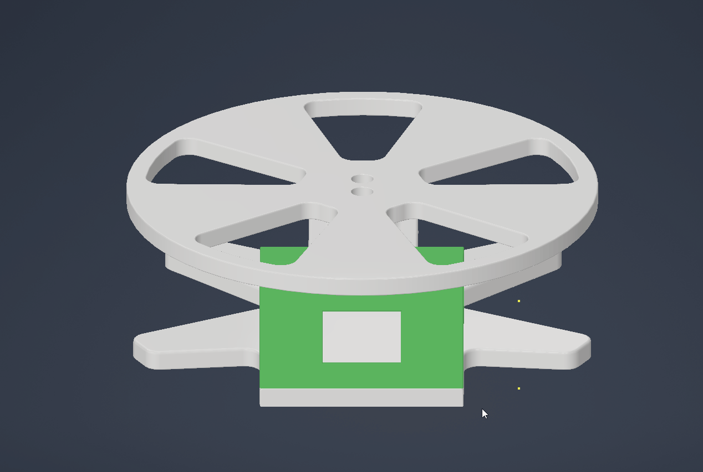

## Modifications

To reduce costs, components were sourced from AliExpress instead of Amazon. However, differences in dimensions and mounting hole spacing necessitated adjustments to the 3D-printed parts. Additionally M3 heat inserts were used to limit M4 screws to a minimum.

---

List of parts that were used:
- Display: https://aliexpress.com/item/1005007389730469.html
- Scale(5KG with HX711): https://aliexpress.com/item/1005006827930173.html
- NFC Reader: https://aliexpress.com/item/1005005973913526.html
- NFC Chips: https://aliexpress.com/item/1005006332360160.html
- [VORON](https://vorondesign.com/) Heat Inserts M3 OD5mm L4mm: https://aliexpress.com/item/1005003582355741.html  - make sure to select the correct size

---

- **Parts are designed to be printed in ABS/ASA.** Shrinking compensation not needed.

- **Display and Scale Adjustments:** The AliExpress-sourced display and scale had different dimensions and hole spacings compared to the Amazon versions. The 3D models were modified to accommodate these differences, ensuring proper fit and functionality.
   -  measurement of my Display & Scale to check if your parts will fit can be found in the images folder

- **Screw Size and Heat Inserts:** All holes originally designed for M4 screws were resized to fit M3 screws. Standard VORON heat inserts were incorporated to provide durable threading. This change standardizes the hardware and simplifies assembly.

- **Display Mounting:** The display is now mounted using M3 screws with VORON heat inserts. The display's mounting holes need to be drilled to 3mm to accommodate the M3 screws.

- **Scale Top Surface:** The top surface of the scale was modified to allow M3 socket head cap screws to sit flush with the 3D-printed part. This design ensures that the filament spool rests flat without interference.

- **NFC Reader Mounting:** The NFC reader is also secured using M3 screws and VORON heat inserts, maintaining consistency across all components.

- **Scale Base Mounting:** The only M4 screws required are for attaching the metal part of the scale to its base.

## Benefits of Modifications

- **Cost Reduction:** Sourcing components from AliExpress offers a more affordable alternative to Amazon, making the project more accessible.

- **Standardized Hardware:** Using M3 screws and [VORON](https://vorondesign.com/) heat inserts throughout the assembly simplifies the build process and reduces the variety of required hardware.

- **Enhanced Compatibility:** Adjustments to the 3D models ensure compatibility with readily available components, accommodating variations in part dimensions.

## Assembly Instructions

1. **Component Preparation:**
   - Carefully drill the display's mounting holes to 3mm to fit M3 screws.

2. **Heat Insert Installation:**
   - install VORON M3 heat inserts into the designated holes in the 3D-printed housing/case for the ESP32 and Scale top &#8594; [heat insert location pictures](./Images/README.md)

3. **Component Mounting:**
   - Attach the display, scale, and NFC reader to their respective mounts using M3 screws.
   - Secure the metal part of the scale to its base using M4 screws.

4. **Final Assembly:**
   - Assemble all components according to the original FilaMan instructions, ensuring that all modified parts fit correctly and function as intended.

For detailed assembly guides and additional resources, refer to the [original FilaMan documentation](https://github.com/ManuelW77/Filaman).

## Conclusion

These modifications to the FilaMan project provide a cost-effective and standardized approach to building a filament management system. By sourcing components from AliExpress and adjusting the 3D models accordingly, users can achieve the same functionality at a reduced cost, with the added benefit of using uniform hardware throughout the assembly.

## Changelog

### Version 1.0 - 2025-03-04
- Initial release of modifications for AliExpress-sourced components.
- Adjusted 3D models to fit different display and scale dimensions.
- Replaced M4 screws with M3 screws and integrated VORON heat inserts.
- Modified display mounting, requiring drilling to 3mm for M3 screws.
- Adjusted scale top surface for flush screw placement.
- Standardized NFC reader mounting with M3 screws and VORON heat inserts.
- Retained M4 screws only for metal scale attachment.
